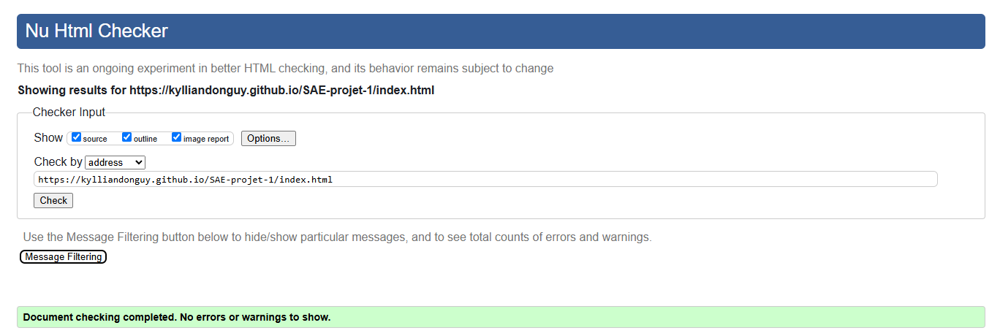
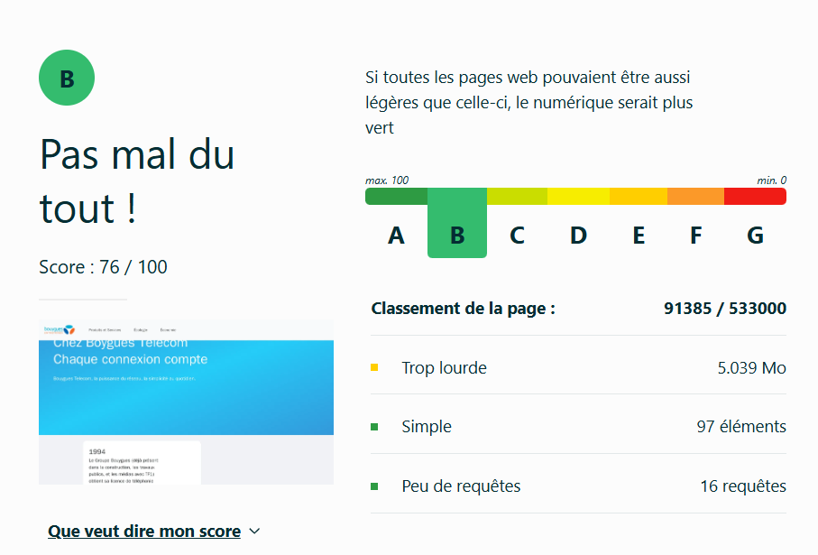
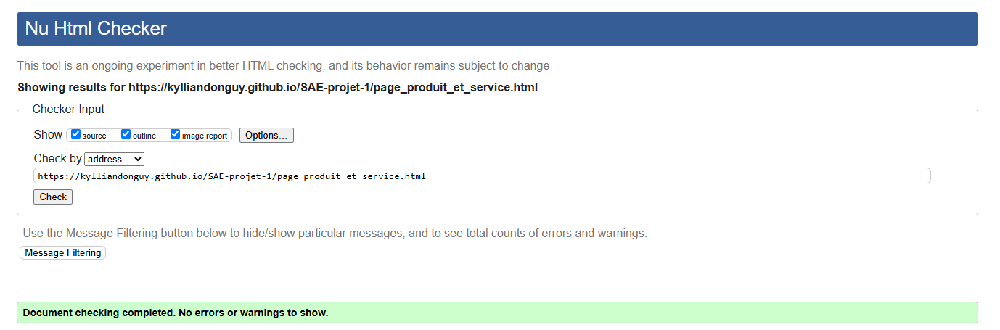
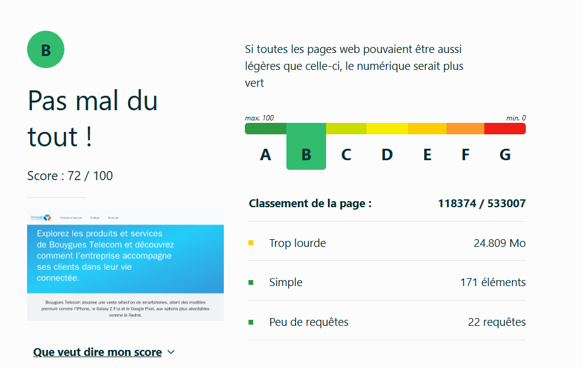
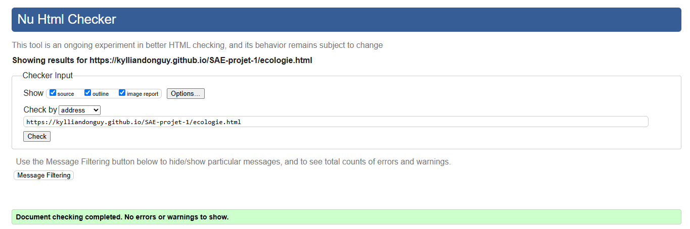
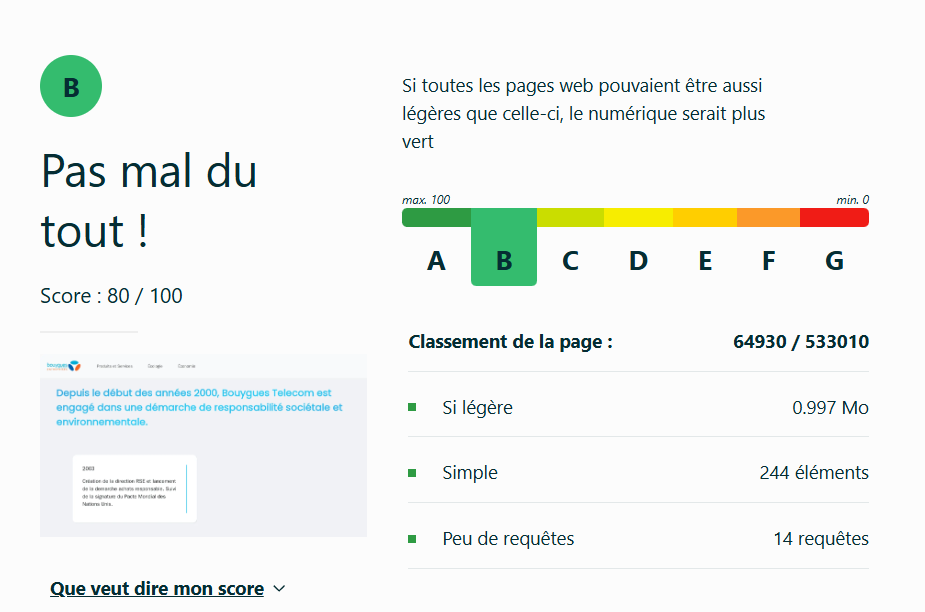
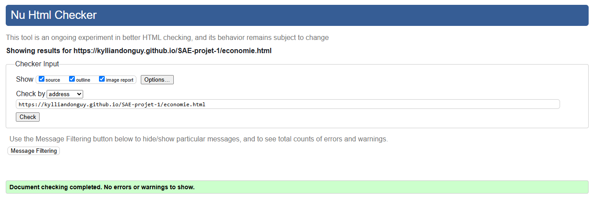
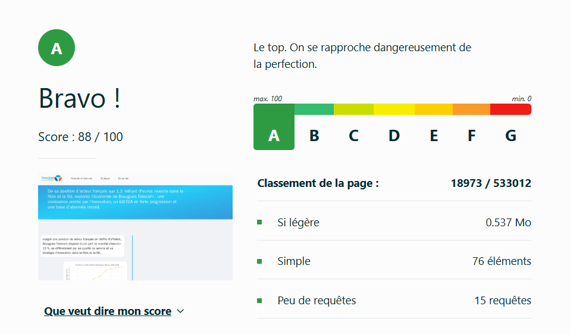
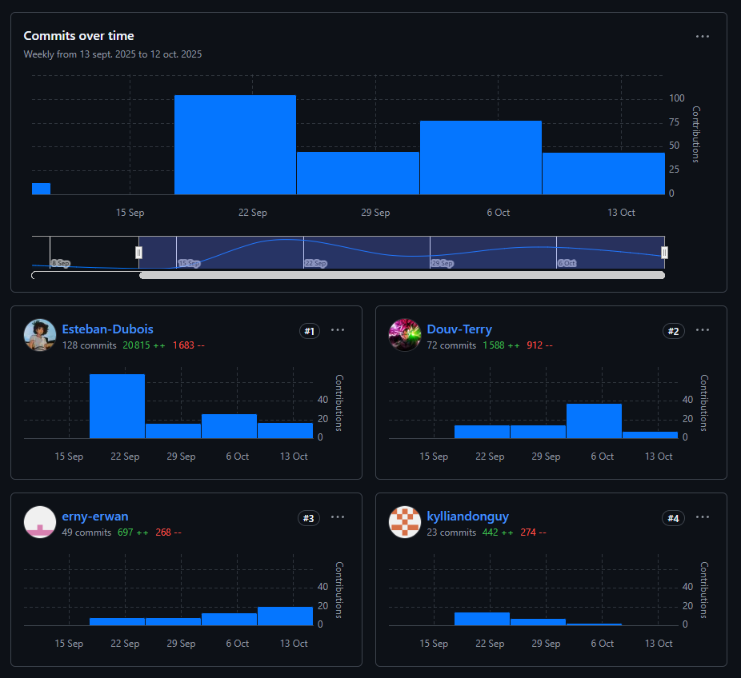

# Titre sujet   

SAE-projet-1

## Sujet   

[SAE-projet-1](https://github.com/kylliandonguy/SAE-projet-1)

## Site

[site](https://kylliandonguy.github.io/SAE-projet-1/)

## Membres du groupe

Etudiant 1 (référent du groupe) :  [erny erwan](mailto:erwan.erny@edu.univ-fcomte.fr?subject=SAE_1_05_06)  
Etudiant 2 : [donguy kyllian](mailto:kyllian.donguy@edu.univ-fcomte.fr?subject=SAE_1_05_06)   
Etudiant 3 : [dubois esteban](mailto:esteban.dubois@edu.univ-fcomte.fr?subject=SAE_1_05_06)  
Etudiant 4 : [douville terry ](mailto:terry.douville@edu.univ-fcomte.fr?subject=SAE_1_05_06) 

## Présentation du projet 

Ce dépôt correspond à un site web créé en HTML/CSS/JS dans le cadre de la SAÉ 05-06 à l'IUT de Belfort-Montbéliard. Ce site présente des informations concernant Bouygues Telecom et sert de vitrine pour présenter l'entreprise, son histoire, ses produits, ses services, ses engagements environnementaux et ses resultats économiques.

## Choix de conception 

Pour la conception du site, nous nous sommes grandement inspirés du site officiel de Bouygues Telecom (disponible [ICI](https://www.bouyguestelecom.fr/)).

## Développement Site Web et Validation des pages

### Page d'accueil 

**Auteur : Erny Erwan **

Vérification W3C : [Détail ICI](https://validator.w3.org/nu/?showsource=yes&showoutline=yes&showimagereport=yes&doc=https%3A%2F%2Fkylliandonguy.github.io%2FSAE-projet-1%2Findex.html)

Vérification écoconception : [Détail ICI](https://www.ecoindex.fr/resultat/?id=d6b26fd0-309e-4bd7-9e17-ac8d35148ebc)

### Page produits et services

**Auteur : Dubois Esteban **

Vérification W3C : [Détail ICI](https://validator.w3.org/nu/?showsource=yes&showoutline=yes&showimagereport=yes&doc=https%3A%2F%2Fkylliandonguy.github.io%2FSAE-projet-1%2Fpage_produit_et_service.html)

Vérification écoconception : [Détail ICI](https://www.ecoindex.fr/resultat/?id=215623bd-b227-4089-adac-0b0a7618d5c2)

### Page écologie 

**Auteur : Douville Terry **

Vérification W3C : [Détail ICI](https://validator.w3.org/nu/?showsource=yes&showoutline=yes&showimagereport=yes&doc=https%3A%2F%2Fkylliandonguy.github.io%2FSAE-projet-1%2Fecologie.html)

Vérification écoconception : [Détail ICI](https://www.ecoindex.fr/resultat/?id=3000b6c4-bae3-44bc-abc0-0a22c7ec8bf3)

### Page économie 

**Auteur : Donguy Kyllian **

Vérification W3C : [Détail ICI](https://validator.w3.org/nu/?showsource=yes&showoutline=yes&showimagereport=yes&doc=https%3A%2F%2Fkylliandonguy.github.io%2FSAE-projet-1%2Feconomie.html)

Vérification écoconception : [Détail ICI](https://www.ecoindex.fr/resultat/?id=84167a5f-f460-4dff-9e2f-a019efb87979)

## Répartition du Travail

### Planification - Diagramme de GANTT

- Erny Erwan

### Recherche d'informations 

- Donguy Kyllian
- Douville Terry
- Dubois Esteban
- Erny Erwan

### Développement site

- Erny Erwan 
    - Page d'Accueil
    - Navbar

- Donguy Kyllian 
    - Page economie

- Douville Terry
    - Page ecologie

- Dubois Esteban 
    - Page produit et service
    - Page economie
    - Page ecologie
    - Footer

## Contributeurs 

